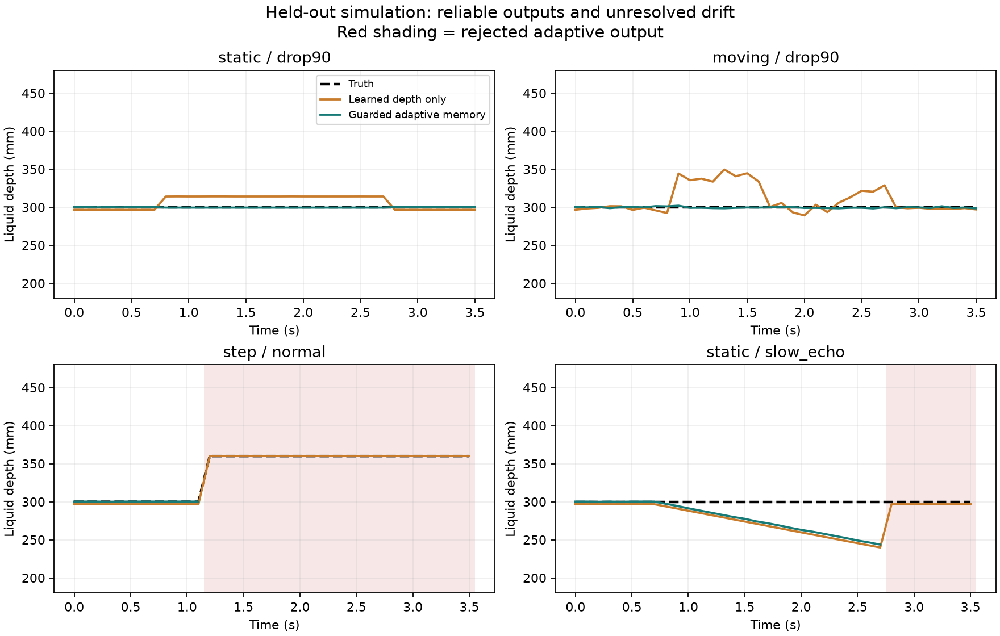

# 大面积深度失效：连续仿真视频验证与时序优化

日期：2026-09-05。状态：实验分支，可通过独立接口调用，尚未提升为默认生产路线。

## 实验范围

生成 792 张连续渲染 RGB-D 图像，回放 7920 帧条件组合。场景覆盖圆柱与矩形容器；9107、9212 用于开发及消融，9323 在冻结方案后生成，作为最终独立场景检查。大量相邻帧高度相关，不能当成相同数量的独立实验。
相机位于容器上方，约 1.1 m 安装高度；液深主要为 0.30–0.36 m。普通序列 36 帧、长序列 120 帧，按 10 Hz 采样；常规空洞持续 2 s，长序列 95% 空洞持续 11.2 s。
使用 v8 通用 RGB-D 模型真实推理，输入与训练一致的 RGB 归一化、对数米制深度和有效性。RGB 由 Blender Eevee 渲染，传感器深度使用已有仿真噪声，再施加连续区域失效。没有使用真值掩码筛选模型输出；真值掩码只用于构造传感器故障及计算实际失效率。
内参、重力、容器底面及相机位姿由仿真标定提供；另注入 25 mm 位姿偏差作为压力测试。本轮不等价于视觉位姿估计已经验证，也不覆盖全部 0.1–10 m 量程或所有透明材质。

## 本轮实现

新增米制液面记忆路径：模型液面区域 → 腐蚀边缘 → 当前有效深度锚点 → 重力坐标下鲁棒平面 → 历史点按当前液位增量更新 → 位姿重投影、光流与 RGB 外观检查 → 融合与可观测性拒绝 → 相对已标定底面的液深。
历史点最多保留 45 帧，保存 4 组有足够空间覆盖的直接观测；每个空间单元只计一次，历史占比不超过 75%。当前至少需 24 个可靠点；有合格历史时允许较小的当前空间覆盖，但至少需要 64 个有效历史点。完全没有当前米制证据时拒绝输出。
液位按当前可靠点估计的高度变化更新历史，避免缓慢加液时拖向旧平面。相邻已接受结果相差超过 15 mm 时锁定拒绝，必须由可靠的新参考重新初始化。这是可配置的运行约束，不是能够自动区分真实液位跃升和错误回波的识别器。

## 独立场景：失效窗口内结果

开发集消融显示无条件记忆会轻微降低静止场景精度，最终改成按需启用：当前可靠点的空间支撑足够时直接使用当前估计；只有支撑不足时才启用历史恢复。

容差为 max(5 mm, 真值液深×2%)。MAE、AbsRel、通过率只针对被接受输出，覆盖率分母是窗口内全部帧。无输出记为缺失，不记作零误差。

| 运动 | 注入失效条件 | 实际有效深度占比 | 输出覆盖率 | 液深 MAE/mm | AbsRel/% | 容差通过率 | 困难场景工程门槛 |
|---|---|---:|---:|---:|---:|---:|---|
| static | normal | 96.52% | 100.0% | 0.18 | 0.06 | 100.00% | 满足本窗口数值门槛 |
| static | drop75 | 23.52% | 100.0% | 0.90 | 0.30 | 100.00% | 满足本窗口数值门槛 |
| static | drop90 | 9.31% | 100.0% | 0.45 | 0.15 | 100.00% | 满足本窗口数值门槛 |
| static | drop98 | 1.54% | 0.0% | - | - | -% | 未满足/应拒绝 |
| static | total | 0.00% | 0.0% | - | - | -% | 未满足/应拒绝 |
| static | long95 | 4.41% | 0.0% | - | - | -% | 未满足/应拒绝 |
| static | wrong_echo | 96.52% | 0.0% | - | - | -% | 未满足/应拒绝 |
| static | pose_error | 96.52% | 0.0% | - | - | -% | 未满足/应拒绝 |
| static | cold_total | 0.00% | 0.0% | - | - | -% | 未满足/应拒绝 |
| rising | normal | 98.76% | 100.0% | 0.51 | 0.16 | 100.00% | 满足本窗口数值门槛 |
| rising | drop75 | 24.40% | 100.0% | 0.52 | 0.16 | 100.00% | 满足本窗口数值门槛 |
| rising | drop90 | 9.61% | 100.0% | 0.79 | 0.25 | 100.00% | 满足本窗口数值门槛 |
| rising | drop98 | 1.74% | 0.0% | - | - | -% | 未满足/应拒绝 |
| rising | total | 0.00% | 0.0% | - | - | -% | 未满足/应拒绝 |
| rising | long95 | 4.65% | 0.0% | - | - | -% | 未满足/应拒绝 |
| rising | wrong_echo | 98.76% | 0.0% | - | - | -% | 未满足/应拒绝 |
| rising | pose_error | 98.76% | 0.0% | - | - | -% | 未满足/应拒绝 |
| rising | cold_total | 0.00% | 0.0% | - | - | -% | 未满足/应拒绝 |
| moving | normal | 99.01% | 100.0% | 0.53 | 0.18 | 100.00% | 满足本窗口数值门槛 |
| moving | drop75 | 24.33% | 100.0% | 0.55 | 0.18 | 100.00% | 满足本窗口数值门槛 |
| moving | drop90 | 9.53% | 100.0% | 0.77 | 0.26 | 100.00% | 满足本窗口数值门槛 |
| moving | drop98 | 1.65% | 0.0% | - | - | -% | 未满足/应拒绝 |
| moving | total | 0.00% | 0.0% | - | - | -% | 未满足/应拒绝 |
| moving | long95 | 4.63% | 0.0% | - | - | -% | 未满足/应拒绝 |
| moving | wrong_echo | 99.01% | 0.0% | - | - | -% | 未满足/应拒绝 |
| moving | pose_error | 99.01% | 0.0% | - | - | -% | 未满足/应拒绝 |
| moving | cold_total | 0.00% | 0.0% | - | - | -% | 未满足/应拒绝 |
| step | normal | 98.64% | 20.0% | 0.18 | 0.06 | 100.00% | 未满足/应拒绝 |
| step | drop75 | 24.11% | 20.0% | 0.90 | 0.30 | 100.00% | 未满足/应拒绝 |
| step | drop90 | 9.42% | 20.0% | 0.45 | 0.15 | 100.00% | 未满足/应拒绝 |
| step | drop98 | 1.61% | 0.0% | - | - | -% | 未满足/应拒绝 |
| step | total | 0.00% | 0.0% | - | - | -% | 未满足/应拒绝 |
| step | long95 | 4.30% | 0.0% | - | - | -% | 未满足/应拒绝 |
| step | wrong_echo | 98.64% | 0.0% | - | - | -% | 未满足/应拒绝 |
| step | pose_error | 98.64% | 0.0% | - | - | -% | 未满足/应拒绝 |
| step | cold_total | 0.00% | 0.0% | - | - | -% | 未满足/应拒绝 |
| long_static | normal | 96.52% | 100.0% | 0.17 | 0.06 | 100.00% | 满足本窗口数值门槛 |
| long_static | drop75 | 23.52% | 100.0% | 0.90 | 0.30 | 100.00% | 满足本窗口数值门槛 |
| long_static | drop90 | 9.31% | 100.0% | 0.45 | 0.15 | 100.00% | 满足本窗口数值门槛 |
| long_static | drop98 | 1.54% | 0.0% | - | - | -% | 未满足/应拒绝 |
| long_static | total | 0.00% | 0.0% | - | - | -% | 未满足/应拒绝 |
| long_static | long95 | 4.45% | 16.1% | 0.70 | 0.23 | 100.00% | 未满足/应拒绝 |
| long_static | wrong_echo | 96.52% | 0.0% | - | - | -% | 未满足/应拒绝 |
| long_static | pose_error | 96.52% | 0.0% | - | - | -% | 未满足/应拒绝 |
| long_static | cold_total | 0.00% | 0.0% | - | - | -% | 未满足/应拒绝 |

## 消融：记忆的独立贡献

以下均为独立场景、90% 空洞的失效窗口。guarded_fresh 与 surface_memory 使用相同跳变门控，仅后者使用历史点；因此可以分离门控和记忆的效果。

| 运动 | 方法 | 覆盖率 | MAE/mm | P95/mm |
|---|---|---:|---:|---:|
| static | network | 100.0% | 14.16 | 14.21 |
| static | fresh_geometry | 100.0% | 0.45 | 0.45 |
| static | guarded_fresh | 100.0% | 0.45 | 0.45 |
| static | surface_memory | 100.0% | 0.45 | 0.45 |
| rising | network | 100.0% | 13.60 | 19.97 |
| rising | fresh_geometry | 100.0% | 0.79 | 1.32 |
| rising | guarded_fresh | 100.0% | 0.79 | 1.32 |
| rising | surface_memory | 100.0% | 0.79 | 1.32 |
| moving | network | 100.0% | 22.52 | 44.93 |
| moving | fresh_geometry | 80.0% | 0.84 | 1.66 |
| moving | guarded_fresh | 80.0% | 0.84 | 1.66 |
| moving | surface_memory | 100.0% | 0.77 | 1.54 |

## 恢复与延时

恢复时间定义为故障结束后首次连续 3 帧被接受且在容差内的确认时间；未在观察窗口恢复的记录保留为空，不赋予 0。

| 序列 | 故障 | 恢复确认时间/s |
|---|---|---:|
| 9323_static | drop90 | 0.20 |
| 9323_static | total | 0.20 |
| 9323_static | wrong_echo | 0.20 |
| 9323_rising | drop90 | 0.20 |
| 9323_rising | total | - |
| 9323_rising | wrong_echo | - |
| 9323_step | drop90 | - |
| 9323_step | total | - |
| 9323_step | wrong_echo | - |
| 9323_moving | drop90 | 0.20 |
| 9323_moving | total | 0.20 |
| 9323_moving | wrong_echo | 0.20 |

独立场景模型推理加记忆/几何处理 P95：6.61 ms（320×180、模型常驻 GPU；不包括渲染、磁盘读取、相机采集、位姿求解和界面显示）。不能把它直接视为现场相机到显示的端到端延时。

## 仍未解决的问题

1. 全失效、初始化就失效、98% 失效及长期高度局部化的残余点：主要靠拒绝保护，没有证明能够恢复有效液深。
2. 真实 60 mm 液位突变：会触发与错误回波相同的锁定，覆盖率下降。需要来自液位接触线、泵/阀流量、独立姿态或其他传感信息支持重新确认，不能通过放宽门限直接解决。
3. 稳定但错误的回波层、缓慢系统漂移、错误标定：几何平整和时序一致都可能成立。只有独立绝对证据才能排除；本轮跳变门控只处理突变。
4. 本轮条件较窄，尚需扩展真实传感器误差形态、低照度、多层透明、波动和漂浮物。结果不能推出全量程毫米级工业精度。
5. 模型置信度用于初筛，尚未在此新序列任务中作概率校准；拟合残差不能代替测量不确定度。可评估输出率在仿真中高，是因为真值齐全，不代表现场可观测性。

## 调用与复现

模块与界面分离：使用 liquid_depth.surface_video_runtime.UniversalSurfaceVideoSystem，逐帧调用 process(rgb_bgr, raw_depth_m, intrinsics, camera_to_world_cv, bottom_world_m)。深度单位必须为米，位姿采用 OpenCV 相机坐标到固定重力世界坐标的 4×4 变换。相机移动时必须输入当前已验证位姿。
超过配置跳变限制后，只有新参考得到确认才能调用 reset_reference()。缺失值必须由 accepted/reasons 呈现，不能把拒绝帧显示成最新有效测量。
复现脚本：scripts/generate_temporal_sequences.py（Blender）、scripts/evaluate_temporal_video.py（推理评估）、scripts/summarize_temporal_video.py（本报告）。报告旁的指标 JSON 保留 checkpoint SHA256、分场景消融和恢复结果；服务器保留逐帧 JSON 与 RGB-D 数据。

## 附加反例：缓慢错误回波

在深度上每帧增加 3 mm 偏差，独立静止场景中覆盖率 100.0%，MAE 29.69 mm，已输出结果的越界比例 90.00%。这直接说明跳变门控无法覆盖缓慢漂移，不能宣布大面积失效问题已整体解决。

记忆实际触发 4 帧；触发子集 P95 为 29.60 ms，全部帧最大处理时间 29.92 ms。

